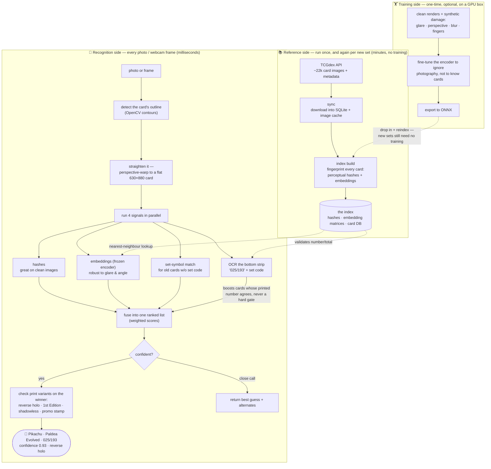

# pokeum

Point a camera at a Pokémon card and pokeum tells you **exactly which printing it is** — name, set, and collector number (e.g. *Pikachu · Paldea Evolved · 025/193*) plus print variants like reverse holo or 1st Edition. It ships as a Python library, a CLI, and a small HTTP API.

```bash
python -m venv .venv && . .venv/Scripts/activate
pip install -r requirements.txt
python main.py sync              # download the card catalogue from TCGdex (once)
python main.py index build      # precompute the matching index (once)
python main.py identify my_card_photo.jpg
python main.py scan             # live webcam mode
python main.py serve            # HTTP API on :8000
```

Documentation lives in [`openwiki/quickstart.md`](openwiki/quickstart.md); this README is the map, not the manual.

## How it works, end to end

The one idea that shapes everything: **pokeum never trains a model to recognize cards.** Instead it *looks cards up*. Every card ever printed has a clean reference image on [TCGdex](https://tcgdex.dev); pokeum downloads those once, computes a compact "fingerprint" of each (perceptual hashes + neural-network embeddings from a **frozen** encoder), and stores them in an index. Recognizing a photo is then just: clean the photo up, fingerprint it the same way, and find the closest match — with the card's printed collector number (read by OCR) settling any tie between reprints that share the same artwork.

Because recognition is a lookup, **a new set costs zero training**: run `sync` + `index build` and its cards are recognizable minutes after release.



Reading the diagram in one breath: **top-left** happens once (and per new set) — download, fingerprint, store. **Middle** happens per photo — find the card, flatten it, fingerprint it four different ways, merge the votes, and only claim a match when the evidence is strong; the OCR'd collector number is what separates two printings of the same artwork. **Bottom** happened once on a GPU: the encoder was taught that a glared, tilted, blurry photo of a card is *the same card* as its clean render — it learned to ignore cameras, not to memorize cards, which is why it never needs retraining.

Webcam mode adds one wrapper: results are aggregated over a sliding window of frames and a card is only announced once it wins several frames in a row — one stable answer per card shown, instead of a flickering guess per frame.

## The Claude Code stack

The `.claude/` directory turns a session into a guarded feedback loop. Everything below is repo-contained — clone + Claude Code is the whole install.


The pieces, in one table:

| Piece | Where | What it does |
|---|---|---|
| **Rules** | `.claude/rules/` | Always-on conventions: workflow discipline, settings/constants, code style, test style |
| **Skills** | `.claude/skills/` | `/openwiki` (docs autopilot), `/verify` (full gate + auto-fix), `/ship` (commit→push→PR the team way, guard-aware), `/new-setting` (config checklist), `/runbook-add` (teach the error-matcher a new fix), `/tune` (audit recent sessions for friction, propose allowlist/rules/runbook fixes) |
| **Hooks** | `.claude/hooks/` | The seven automations in the diagram — briefs, routing, formatting, runbook hints, cached sweeps, commit guards, secret-file protection |
| **OpenWiki** | `openwiki/` | Agent-oriented docs where every page declares the source files it covers; staleness is *computed*, and commits are gated on it |
| **Permissions** | `.claude/settings.json` | Pre-approved gate/git/toolkit commands (no prompt fatigue); reads of `.env` denied |
| **Headroom** (optional) | `scripts/claude-headroom.*` | Start a session behind a context-compression proxy for token-heavy work |

### Day-one workflow

1. Run `claude` in the repo and just work — conventions are enforced, not memorized.
2. Trust the injections: the session brief, wiki routing, and runbook hints exist so neither you nor the agent rediscovers known things.
3. When a commit gets blocked, the message says exactly why and how to proceed — the escapes (`OPENWIKI_SKIP=1`, `VERSION_OK=1`) are deliberate, explained exceptions, not workarounds.
4. Ship with `/ship`: Conventional Commits, semver bump, `dev` as trunk (there is no `main`), PRs into `dev`.
5. Docs stay honest by construction: change code → the covering wiki page goes stale → `/openwiki` fixes it → the commit guard keeps everyone honest in between.
