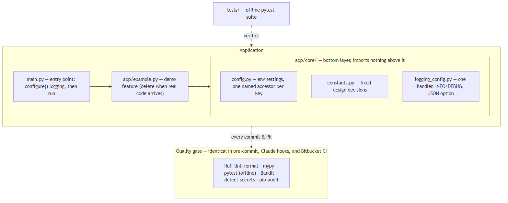
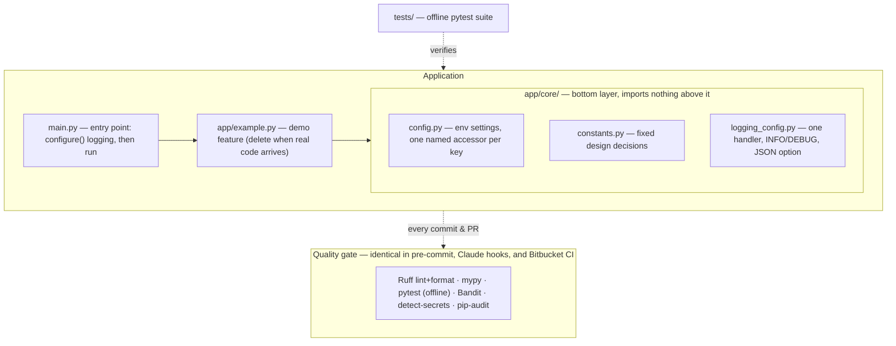
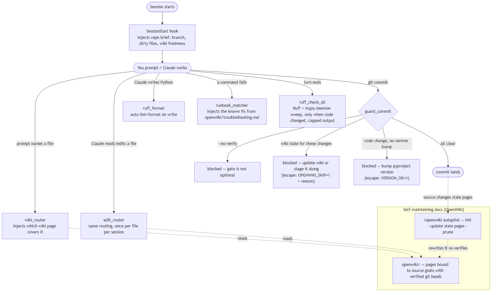
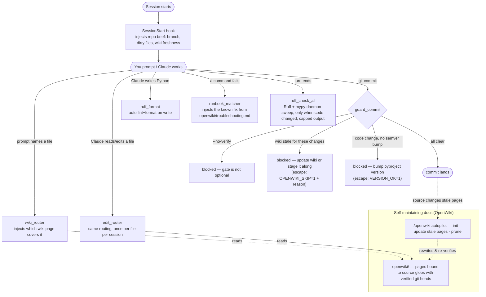

# vva-python-template

VVA's starter template for Python 3.13 projects — and the **golden baseline** for our Claude Code setup. It ships two stacks in one repo: a minimal, correctly-wired application skeleton, and an agent-automation layer that makes Claude Code sessions fast, guarded, and self-documenting.

New here? Do this, then read the diagrams below:

```bash
./scripts/fresh-start.sh        # once: detach from the template (drops its git history, re-inits on `dev`)
python -m venv .venv && . .venv/Scripts/activate
pip install -r requirements-dev.txt
pre-commit install
python main.py                  # run
python -m pytest                # test
claude                          # start an agent session — everything below kicks in automatically
```

Documentation lives in [`openwiki/quickstart.md`](openwiki/quickstart.md) (humans *and* agents start there) and the always-on agent rules in [`.claude/rules/`](.claude/rules). This README is the onboarding map, not the manual.

## The application stack

Small on purpose: a layered skeleton with the boring parts wired correctly, plus one example feature to copy and then delete.



<details>
<summary>Diagram source (mermaid) — regenerate with <code>npx -y @mermaid-js/mermaid-cli -i chart.mmd -o assets/application-stack.png -b white -s 2</code></summary>



</details>

Two rules carry most of the design: **settings vs constants** (varies per environment → accessor in `config.py`; fixed design choice → constant in `constants.py`; `os.environ` is never read anywhere else) and **`app/core/` never imports from the rest of `app/`** — that's what keeps the test suite offline.

## The Claude Code stack

The `.claude/` directory turns a session into a guarded feedback loop. Everything below is repo-contained — clone + Claude Code is the whole install.



<details>
<summary>Diagram source (mermaid) — regenerate with <code>npx -y @mermaid-js/mermaid-cli -i chart.mmd -o assets/claude-code-stack.png -b white -s 2</code></summary>



</details>

The pieces, in one table:

| Piece | Where | What it does |
|---|---|---|
| **Rules** | `.claude/rules/` | Always-on conventions: workflow discipline, settings/constants, code style, test style |
| **Skills** | `.claude/skills/` | `/openwiki` (docs autopilot), `/verify` (full gate + auto-fix), `/ship` (commit→push→PR the team way, guard-aware), `/new-setting` (config checklist), `/runbook-add` (teach the error-matcher a new fix), `/tune` (audit recent sessions for friction, propose allowlist/rules/runbook fixes) |
| **Hooks** | `.claude/hooks/` | The seven automations in the diagram — briefs, routing, formatting, runbook hints, cached sweeps, commit guards, secret-file protection |
| **OpenWiki** | `openwiki/` | Agent-oriented docs where every page declares the source files it covers; staleness is *computed*, and commits are gated on it |
| **Permissions** | `.claude/settings.json` | Pre-approved gate/git/toolkit commands (no prompt fatigue); reads of `.env` denied |
| **Headroom** (optional) | `scripts/claude-headroom.*` | Start a session behind a context-compression proxy for token-heavy work |

### What this means for you, day one

1. Run `claude` in the repo and just work — conventions are enforced, not memorized.
2. Trust the injections: the session brief, wiki routing, and runbook hints exist so neither you nor the agent rediscovers known things.
3. When a commit gets blocked, the message says exactly why and how to proceed — the escapes (`OPENWIKI_SKIP=1`, `VERSION_OK=1`) are deliberate, explained exceptions, not workarounds.
4. Ship with `/ship`: Conventional Commits, semver bump, `dev` as trunk (there is no `main`), PRs into `dev`.
5. Docs stay honest by construction: change code → the covering wiki page goes stale → `/openwiki` fixes it → the commit guard keeps everyone honest in between.
6. The setup improves itself: diagnosed a tricky error? `/runbook-add`. A session felt slow or naggy? `/tune` finds the friction and proposes the config fix.
